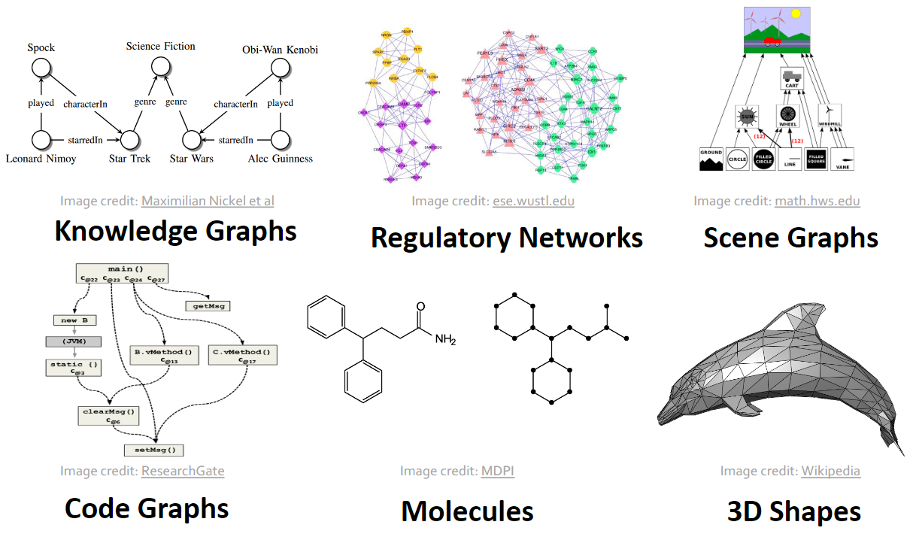
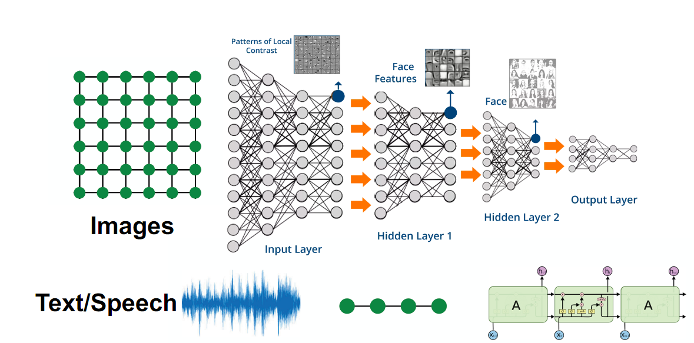
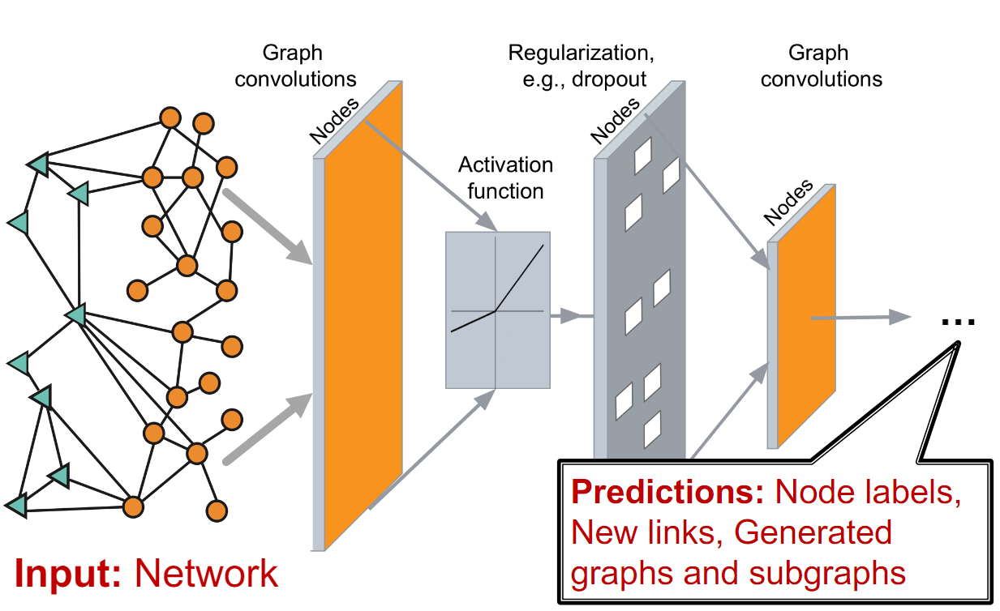
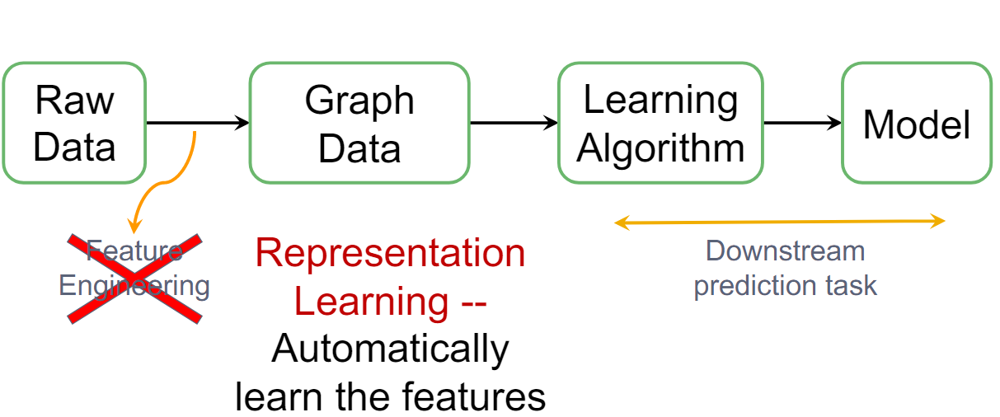
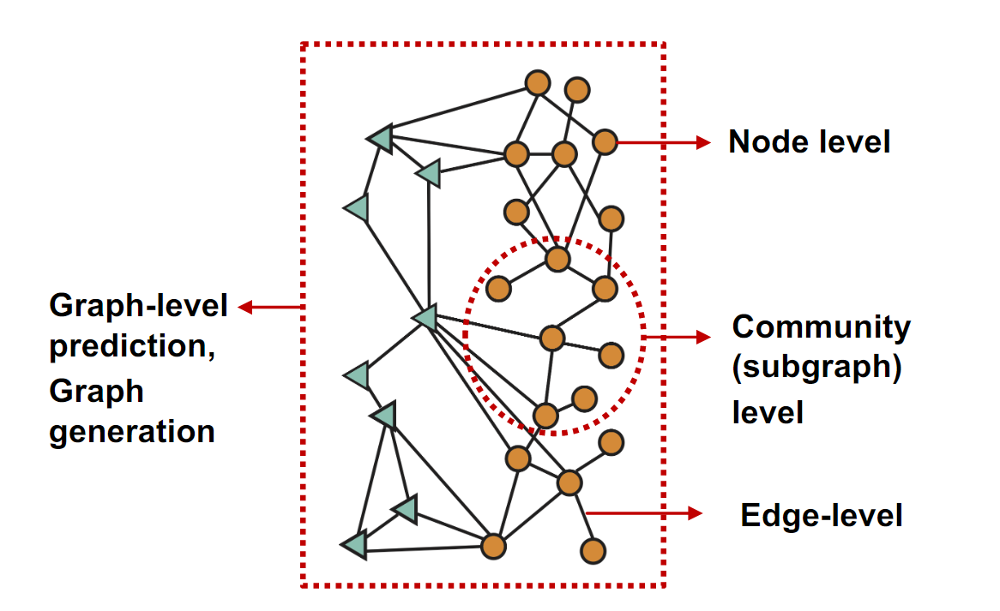
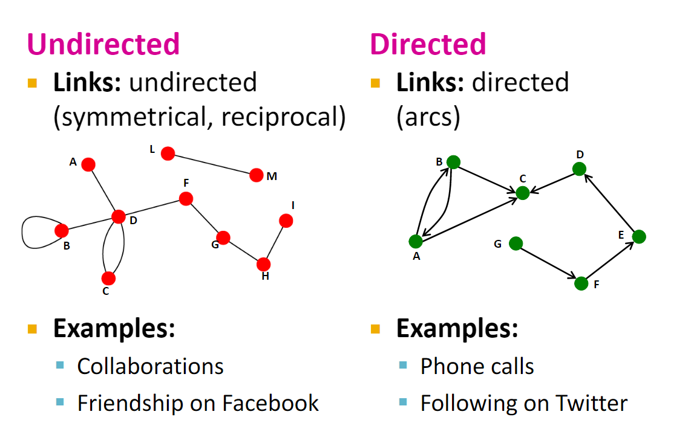
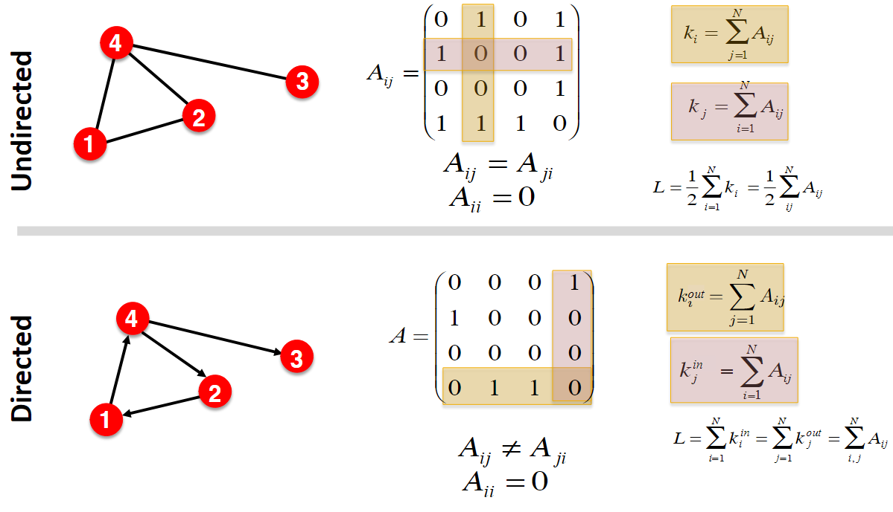
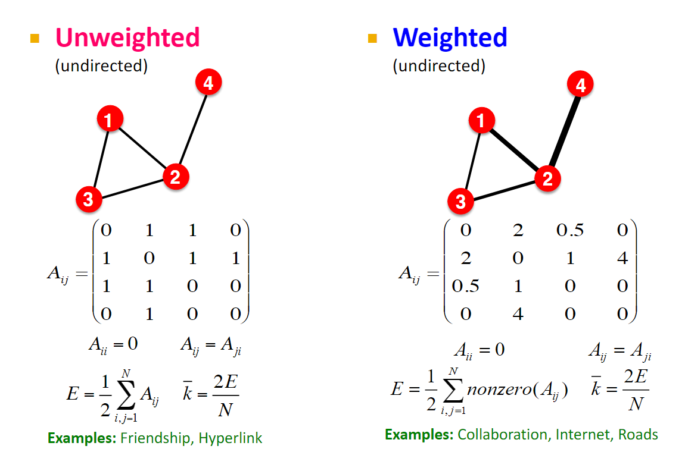

# Machine learning with Graphs

#### 

图的种类

How do we take advantage ofrelational structure for betterprediction?

为了更好的预测关系！

目前的machine learning 模型

目前的deeplearning 工具由简单的网格和序列构成

与神经网络相比：

1.节点位置任意，结构复杂

2.没有固定的节点顺序

3.动态，多模态

Graphs are the new frontierof deep learning

图的模型

lifecycle

# Different types of tasks:

graph ml task

1.Node classification 比如上网用户分类

2.Link prediction 比如知识图谱

3.Graph classification 比如分子性质预测

4.Clustering 比如社会关系

5.Other tasks：

Graph generation：药物

Graph evolution：物理模拟

# Choice of a graph representation：

有向图和无向图：

邻接矩阵

矩阵计算

权重图与非权重图

introduction:why graph!接下去看李牧的gnn入门课

