三种预测

1.Node-level prediction

2.Link-level predictionLink

3.Graph-level prediction

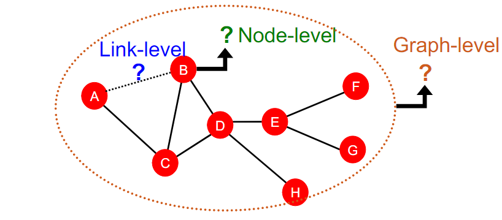

传统机器学习模型

1.随机森林

2.svm

3.神经网络

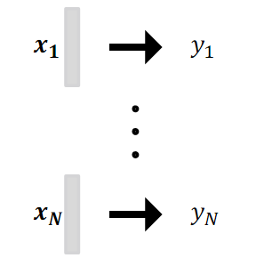

将图应用于模型 给定节点 边 图 来实现预测。

#### 1.node-level

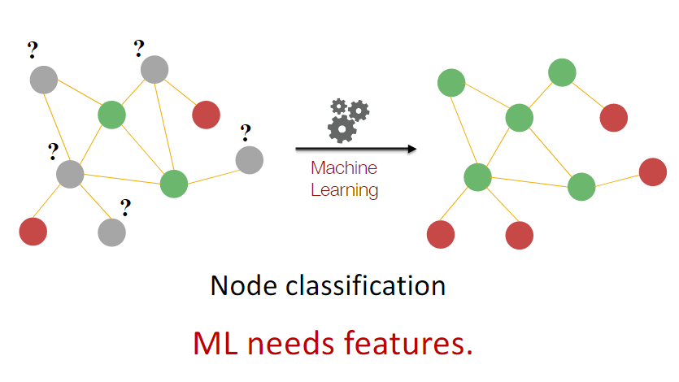

模型重要性的不同区分（Cv）

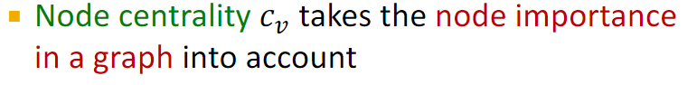

1.Eigenvector centrality（特征向量）

节点v的Cv为所有邻居的Cu之和

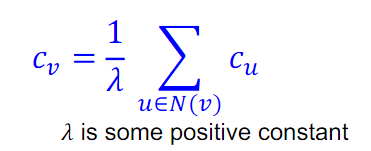

由于采用了递归方式recursive manner，采用邻接矩阵形式重新计算（如果点u是v的邻居 Auv 为1）

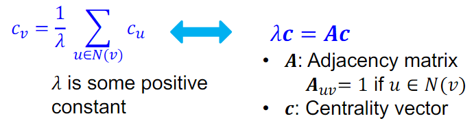

2.Betweenness centrality （中介？）

example

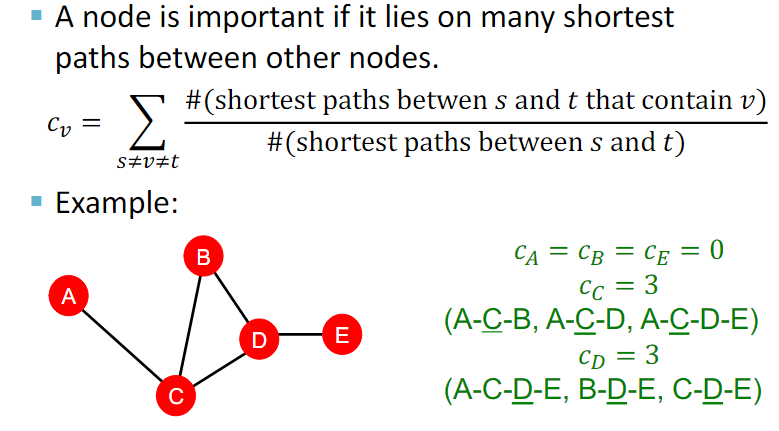

3.Closeness centrality

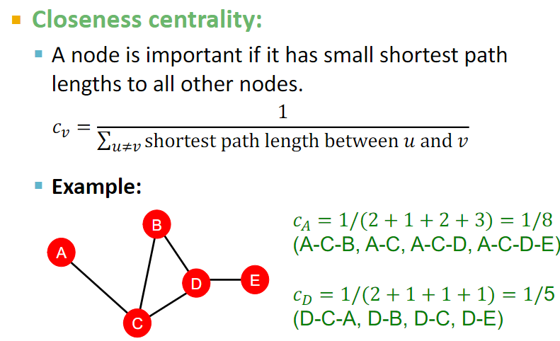

Clustering coefficient(聚类系数)计算  就是在计算闭环三角形的数量

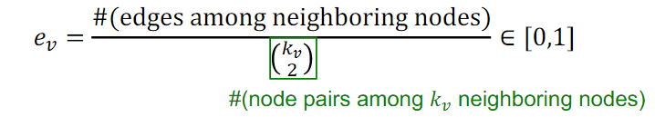

引出 graphlets 的概念

获取节点特征的两种方法

1.基于特征重要性的方法  

例如预测社会关系网上的著名人物

2.基于结构的方法

例如预测蛋白质结构

#### 2.link -level  预测

预测link 的两种方式

1.随机删除边，并进行预测

2.预测随时间变化的图

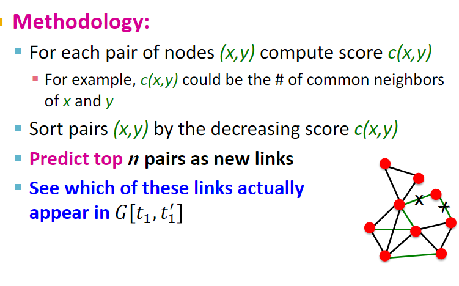

根据score c 进行排序，最大的值便为预测的边

特征化或创建两个节点的关系 的三种方法

1.Distance-based feature

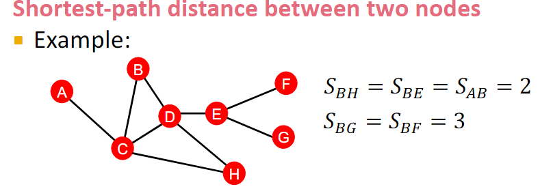

但是不能准确邻居节点

2.Local neighborhood overlap

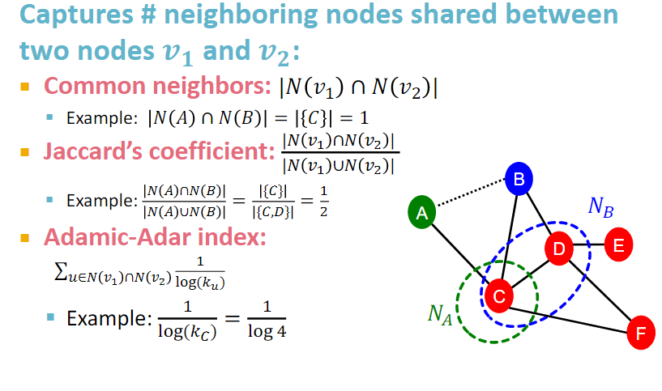

这里三种方式很简单，随便看一下就好了

3.Global neighborhood overlap

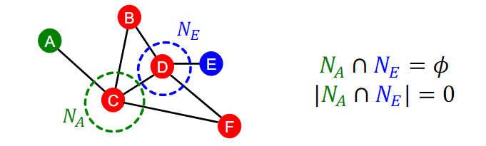

但是有可能会在未来出现

60
